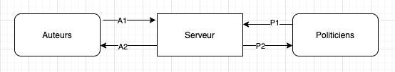

# DOCUMENTATION DETAILLER

## Implementation tour par tour

Dans ce schema c'est le serveur central qui control la transition
des tours en utilisant un timer par exemple, et transmition des 
donnees entre les acteurs du system.

## Implementation roue libre

## Implementation sans serveur centrale